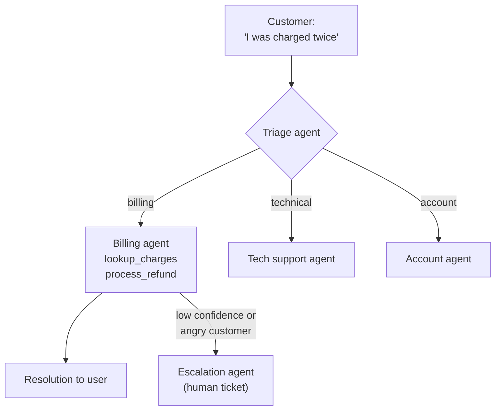

# Example: Customer Support with Agent Routing

## Design Decisions
- **Triage is cheap:** uses a fast model (Haiku) for classification only
- **Specialists are thorough:** use a capable model (Sonnet) with domain tools
- **Escalation is a first-class agent**, not an afterthought — it knows how to summarize the conversation for a human agent
- Each specialist has access to **different backend systems** via MCP

## Handoff Mechanics (Swarm Pattern)
- Triage agent uses `handoff(billing_agent)` with conversation context
- Billing agent can `handoff(escalation_agent)` if it detects it cannot resolve
- Customer experiences one seamless conversation across all agents
