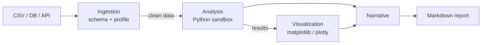

# Example: Data Analysis Pipeline

## Step 1: Ingestion Agent
- **Input:** User query + data source reference (CSV file, database, API endpoint)
- **Action:** Loads data, inspects schema, identifies data quality issues
- **Output:** Clean dataframe + data profile (column types, null counts, distributions)
- **Tools:** `read_csv`, `query_database`, `pandas_profile`
- **Key behavior:** Flags data quality issues before analysis begins — missing values, type mismatches, outliers

## Step 2: Analysis Agent
- **Input:** Clean data + user's analytical question
- **Action:** Writes and executes Python/SQL analysis code in a sandbox
- **Output:** Statistical results, computed metrics, identified patterns
- **Tools:** `execute_python` (sandboxed), `query_database`
- **Key behavior:** Iterates on its own code — if execution fails, it reads the error and fixes the code (up to 3 retries)

## Step 3: Visualization Agent
- **Input:** Analysis results + data + user's original question
- **Action:** Selects appropriate chart types, generates publication-quality visualizations
- **Output:** Chart images (PNG/SVG) + alt-text descriptions
- **Tools:** `execute_python` (matplotlib/plotly), `save_image`
- **Key behavior:** Chooses chart type based on data shape — bar charts for comparisons, line charts for trends, scatter for correlations

## Step 4: Narrative Agent
- **Input:** Analysis results + visualizations + original question
- **Action:** Writes a plain-English summary of findings with embedded charts
- **Output:** Markdown report with key insights, methodology notes, and caveats
- **Tools:** None (pure generation from structured inputs)
- **Key behavior:** Highlights surprising findings and explicitly states limitations

---

**Why not one agent?** The analysis agent needs a code execution sandbox. The visualization agent needs different libraries. The narrative agent needs writing skill, not coding. Separation lets each use the right model temperature and tool set.
