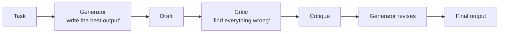

# Self-Reflection: An Agent Critiques Its Own Output



## The Simplest Multi-Agent Pattern
- Same model, two passes: **generate** then **critique**
- The critic pass has a different system prompt focused on finding problems
- Technically one model, but two distinct "agents" with different roles
- Surprisingly effective — often catches 30-50% of errors in the first draft

## How It Works
```python
# Pass 1: Generate
draft = generator_agent.run(
    "Write a function to parse CSV files with error handling"
)

# Pass 2: Reflect
critique = critic_agent.run(f"""
    Review this code for:
    1. Edge cases not handled
    2. Security vulnerabilities
    3. Performance issues
    4. Missing error handling

    Code to review:
    {draft}
""")

# Pass 3: Revise (generator sees its own work + critique)
final = generator_agent.run(f"""
    Original code: {draft}
    Review feedback: {critique}
    Please revise the code addressing all feedback.
""")
```

## Why Separate Prompts Matter
- The generator prompt says: "Write the best code you can"
- The critic prompt says: "Find everything wrong with this code"
- These are fundamentally **different cognitive tasks** — separating them improves both
- A single prompt saying "write code and check it" produces weaker self-critique

## Reflection Checklist Templates
Provide the critic with a structured checklist rather than open-ended critique:
- **Code:** Error handling, edge cases, security, performance, readability
- **Writing:** Accuracy, completeness, tone, audience appropriateness, logical flow
- **Analysis:** Data validity, methodology, statistical significance, alternative explanations

## Limitations
- The critic has the same knowledge gaps as the generator (same model)
- Will not catch errors that require external information (e.g., wrong API syntax)
- Adds one extra LLM call per task — evaluate if the quality gain justifies the cost
- For critical tasks, pair self-reflection with external validation (tests, linters, fact-checking tools)

## Sources

- [Self-Refine: Iterative Refinement with Self-Feedback (Madaan et al., 2023)](https://arxiv.org/abs/2303.17651)
- [Reflexion: Language Agents with Verbal Reinforcement Learning (Shinn et al., 2023)](https://arxiv.org/abs/2303.11366)
