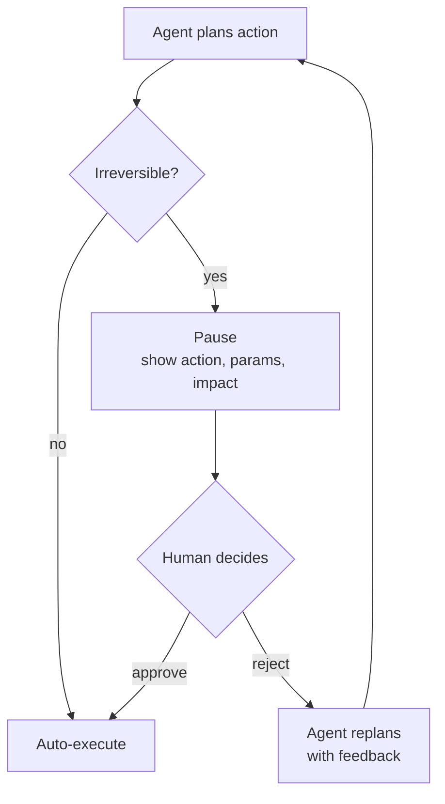

# Approval Gates

Pause before irreversible actions. The most fundamental HITL pattern.



### Implementation pattern:

```python
def approval_gate(action: AgentAction) -> AgentAction:
    if action.is_irreversible or action.risk_level == "high":
        approval = request_human_approval(
            action=action.name,
            params=action.params,
            impact=action.estimated_impact,
            timeout=300  # 5 min timeout
        )
        if not approval.approved:
            return action.replan(reason=approval.feedback)
    return action.execute()
```

**Rule of thumb:** If you cannot undo it, do not auto-execute it.
