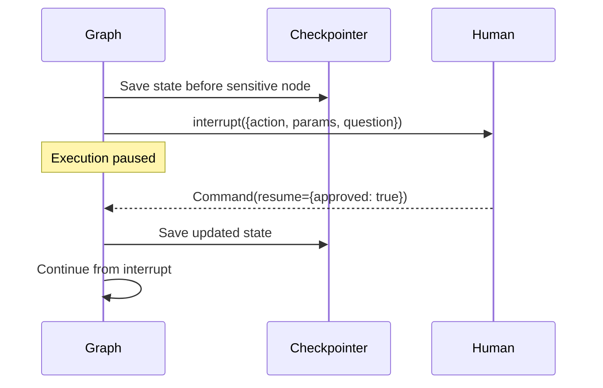

# LangGraph Breakpoints & Interrupt Patterns

Programmatic pause points in agent execution graphs.




## Breakpoints in LangGraph

LangGraph provides first-class support for HITL via `interrupt()`:

```python
from langgraph.graph import StateGraph
from langgraph.types import interrupt, Command

def sensitive_action_node(state):
    """Node that pauses for human approval before executing."""
    action = plan_action(state)

    # This pauses execution and sends data to the human
    human_response = interrupt({
        "action": action.name,
        "params": action.params,
        "question": "Should I proceed with this action?"
    })

    if human_response["approved"]:
        return {"result": execute_action(action)}
    else:
        return {"result": "Action cancelled", "feedback": human_response.get("reason")}
```

## Compile-time breakpoints

```python
# Add breakpoints when compiling the graph
graph = builder.compile(
    checkpointer=checkpointer,
    interrupt_before=["sensitive_action"],  # Pause BEFORE this node
    interrupt_after=["draft_response"],     # Pause AFTER this node
)
```

## Resuming after interrupt

```python
# Human reviews the interrupted state
current_state = graph.get_state(thread_config)
print(current_state.next)       # Which node is paused
print(current_state.tasks)      # Pending interrupt data

# Resume with human input
graph.invoke(
    Command(resume={"approved": True}),
    config=thread_config
)
```

## Key patterns:
- **interrupt_before** — Review inputs before a node runs
- **interrupt_after** — Review outputs before they propagate
- **Dynamic interrupts** — Use `interrupt()` inside node logic for conditional pausing
- **Checkpointer required** — State must be persisted to survive the pause

## Sources

- [LangGraph Interrupts Documentation (LangChain)](https://langchain-ai.github.io/langgraph/concepts/human_in_the_loop/)
- [LangGraph Library (LangChain)](https://langchain-ai.github.io/langgraph/)
