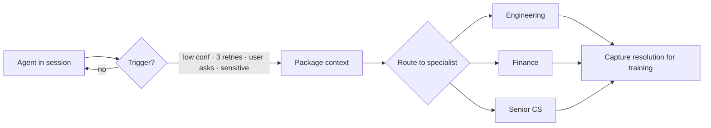

# Escalation Patterns

When and how agents hand off to humans.



## Step 1: Detect Escalation Trigger

Reasons to escalate:
- Confidence below threshold
- User explicitly requests human help
- Error count exceeds limit (3 retries)
- Domain outside agent's scope
- Sensitive/emotional content detected

## Step 2: Preserve Context

Before handing off, package everything the human needs:
- Full conversation history
- Agent's attempted actions and reasoning
- Relevant retrieved documents
- Current state of any in-progress tasks

```python
escalation_package = EscalationContext(
    conversation=state.messages,
    agent_reasoning=state.scratchpad,
    attempted_actions=state.action_log,
    user_sentiment=analyze_sentiment(state.messages),
    priority=determine_priority(state),
)
```

## Step 3: Route to Right Human

Match escalation to expertise:
- **Technical issues** -> Engineering support
- **Billing questions** -> Finance team
- **Complaints** -> Senior customer success
- **Legal/compliance** -> Legal team

## Step 4: Handoff with Warm Transfer

```python
async def escalate(state, reason: str):
    context = build_escalation_context(state)
    human_agent = route_to_specialist(context)

    # Notify human with full context
    await notify_human(human_agent, context)

    # Tell user what's happening
    return "I'm connecting you with a specialist who can help. " \
           "I've shared our conversation context so you won't need to repeat yourself."
```

## Step 5: Learn from Resolution

After human resolves: capture what the agent missed and feed back into training/prompts.
