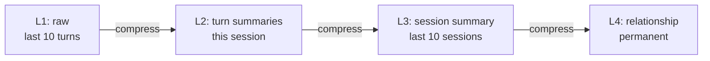

# Summary Memory

Compress long conversations into running summaries. Keep the signal, discard the noise.

## The problem
- A 100-turn conversation might use 50K tokens
- Most of those tokens are routine back-and-forth
- Only a fraction contains critical decisions and facts

## Running summary pattern

```python
from langchain.memory import ConversationSummaryBufferMemory

# Keeps recent messages verbatim + summary of older ones
memory = ConversationSummaryBufferMemory(
    llm=ChatOpenAI(model="gpt-4o-mini"),  # Cheap model for summaries
    max_token_limit=2000,  # Summarize when buffer exceeds this
    return_messages=True,
)
```

## Custom summary with structured extraction

```python
SUMMARY_PROMPT = """Summarize this conversation segment. Extract:
1. Key decisions made
2. User preferences expressed
3. Tasks completed and pending
4. Important facts or constraints mentioned

Previous summary: {existing_summary}
New messages: {new_messages}

Updated summary:"""

async def update_running_summary(existing_summary: str, new_messages: list):
    response = await llm.ainvoke(
        SUMMARY_PROMPT.format(
            existing_summary=existing_summary,
            new_messages=format_messages(new_messages)
        )
    )
    return response.content
```

## Progressive summarization
- **Level 1:** Raw messages (keep last 10)
- **Level 2:** Turn-by-turn summary (keep last session)
- **Level 3:** Session summary (keep last 10 sessions)
- **Level 4:** Relationship summary (permanent, updated weekly)



Each level compresses further, trading detail for longevity.

## Sources

- [LangChain `ConversationSummaryBufferMemory` API Reference (LangChain)](https://reference.langchain.com/python/langchain-classic/memory/summary_buffer/ConversationSummaryBufferMemory)
