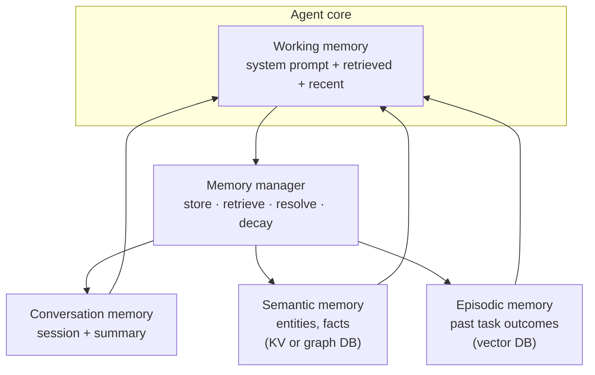

# Memory Architecture

Combining multiple memory types in one agent system.



## Wiring it together

```python
class AgentMemoryManager:
    def __init__(self):
        self.conversation = ConversationSummaryBuffer(llm=cheap_llm)
        self.entities = EntityStore(db=postgres)
        self.episodes = VectorStore(collection="episodes")
        self.preferences = KeyValueStore(db=redis)

    async def build_context(self, current_input: str) -> str:
        """Assemble working memory from all sources."""
        relevant_entities = await self.entities.search(current_input)
        similar_episodes = await self.episodes.similarity_search(current_input, k=3)
        user_prefs = await self.preferences.get_all()
        conv_summary = self.conversation.get_summary()

        return MEMORY_TEMPLATE.format(
            preferences=user_prefs,
            entities=relevant_entities,
            past_episodes=similar_episodes,
            conversation_summary=conv_summary,
        )

    async def store(self, interaction: Interaction):
        """After each turn, update all memory systems."""
        await self.conversation.add_messages(interaction.messages)
        await self.entities.extract_and_store(interaction)
        if interaction.is_notable:
            await self.episodes.store(interaction.to_episode())
```

**Design principle:** Each memory type answers a different question — "What did we just discuss?", "What do I know about X?", "What happened last time I tried this?"

## The dual-layer production standard

The 2026 production pattern splits memory across two paths, coordinated by a dedicated **Memory Node** in the agent graph:

- **Hot Path (in-session)** — Low-latency retrieval that blends vector search, BM25 keyword matching, and entity lookup to assemble working context on every turn.
- **Cold Path (cross-session)** — Asynchronous consolidation that merges facts, resolves conflicts, and prunes stale entries so long-term memory does not bloat or drift.

The Memory Node owns the contract between them: the Hot Path serves the current request while the Cold Path runs out of band to keep the store coherent over time.

## Sources

- [State of AI Agent Memory 2026 (Mem0)](https://mem0.ai/blog/state-of-ai-agent-memory-2026)
