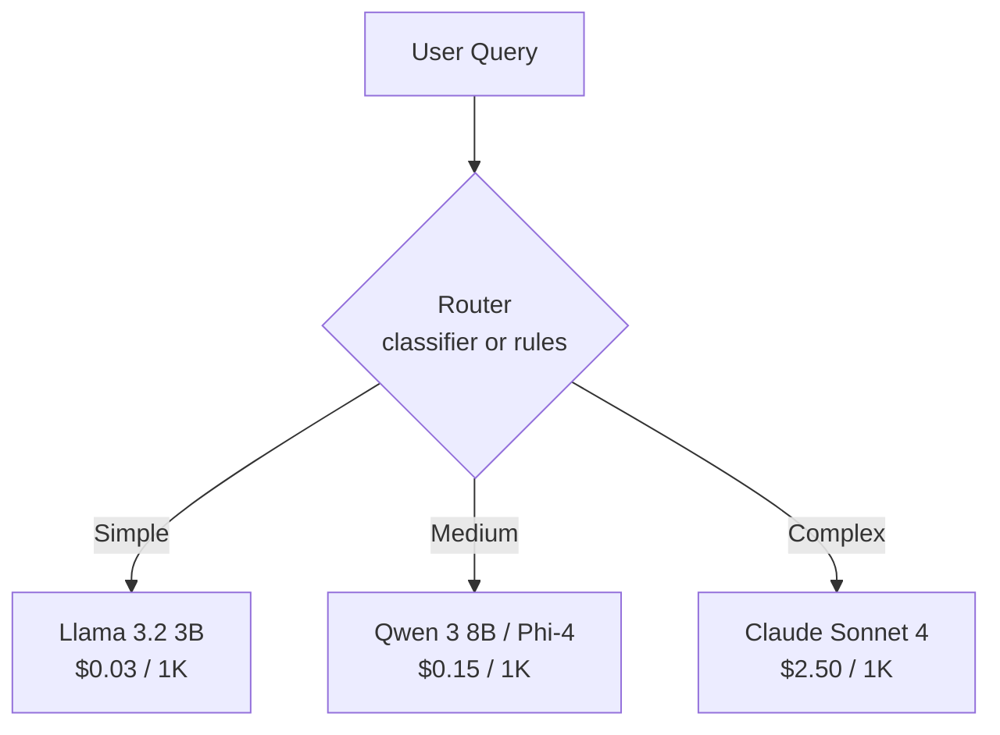

# Model Routing

## Send Easy Queries to Small Models, Hard Queries to Large Models

## Router Implementation Options

| Approach                 | Latency  | Accuracy | Complexity |
|--------------------------|----------|----------|------------|
| Keyword/regex rules      | <1ms     | Low      | Simple     |
| Embedding similarity     | 5–10ms   | Medium   | Medium     |
| Small classifier (1B)    | 10–20ms  | High     | Medium     |
| LLM-as-judge             | 200ms+   | Highest  | High       |

## Real-World Impact

A typical support chatbot: 70% simple, 20% medium, 10% complex.
With routing: **60–80% cost reduction** vs sending everything to a frontier model.

## Sources

- [RouteLLM: Learning to Route LLMs with Preference Data — arXiv:2406.18665 (Ong et al., 2024)](https://arxiv.org/abs/2406.18665)
