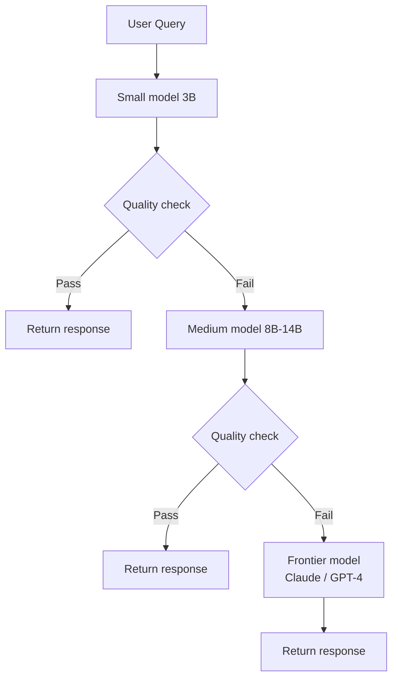

# The Cascade Pattern

## Try Small First, Escalate If Quality Is Low

## Quality Check Strategies

- **Confidence score**: model logprob / entropy threshold
- **Format validation**: does output match expected schema?
- **Length heuristic**: suspiciously short or long responses
- **Self-consistency**: generate twice, check agreement
- **Lightweight verifier**: small classifier trained on good/bad outputs

## Economics

If the cascade resolves 80% at tier 1 and 15% at tier 2:
- Only 5% of requests hit the expensive frontier model
- Average cost drops **10–20x** compared to frontier-only
