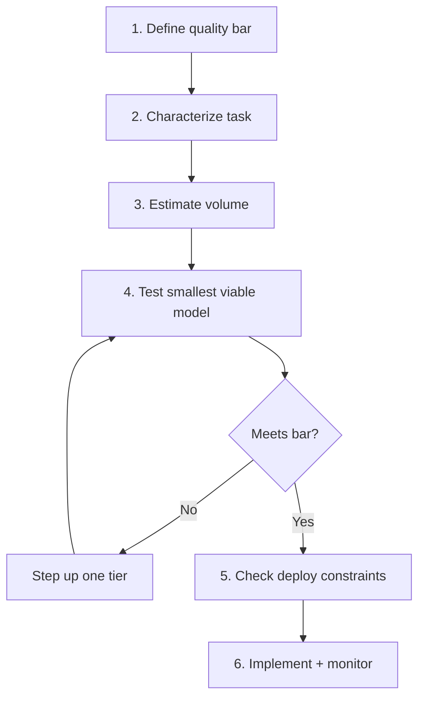

# Decision Framework: When to Go Small

## The Right-Sizing Ladder

Before picking a model size, decide how much machinery the task actually needs. Climb only as high as you must:

**Prompt engineering → RAG → SLM fine-tune → Distill**

Start at the bottom rung and stop at the lowest one that meets your quality bar, rather than defaulting to a frontier model. Most tasks are solved well before the top of the ladder.

## Step 1: Define Your Quality Bar
- What is the minimum acceptable performance?
- Measure with your own eval set, not public benchmarks
- Get stakeholder agreement on the threshold before testing models

## Step 2: Characterize Your Task
- Is it **narrow** (classification, extraction) or **open-ended** (creative writing, analysis)?
- Is the output **structured** (JSON, SQL, labels) or **freeform** (paragraphs, essays)?
- Do you have **labeled training data** (1,000+ examples)?
- Narrow + structured + labeled data = strong signal for small models

## Step 3: Estimate Your Volume
- Under 10K requests/month? Cost matters less — optimize for quality
- 100K–1M requests/month? Model routing starts to pay off
- Over 1M requests/month? Self-hosting becomes economically viable

## Step 4: Test the Smallest Viable Model
- Start with the smallest model in the relevant class
- Run your custom eval suite against it
- If it passes your quality bar, you are done
- If not, move one tier up and repeat

## Step 5: Evaluate Deployment Constraints
- Latency requirement under 100ms? Self-hosted small model required
- Data cannot leave your network? On-premise deployment is now a viable production default, not a niche constraint — on-device inference delivers frontier-comparable performance for many tasks, so keeping all inference on-prem rarely costs you quality
- Need offline capability? Edge/on-device model required
- None of the above? API-served models are simplest

## Sources

- [Best Local LLM Models 2026 (SitePoint)](https://www.sitepoint.com/best-local-llm-models-2026/)
- [The Best Open-Source Small Language Models (BentoML)](https://www.bentoml.com/blog/the-best-open-source-small-language-models)

## Step 6: Implement and Monitor
- Deploy with A/B testing against your current model
- Monitor quality metrics continuously
- Set up alerts for quality degradation
- Keep the larger model as a fallback
