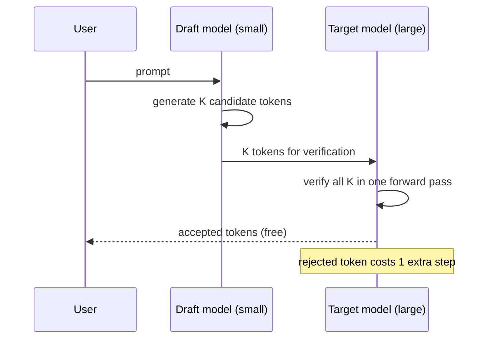

# Continuous Batching and Speculative Decoding

## The Problem with Naive Batching

- Static batching waits for all requests in a batch to finish
- Short requests wait for long ones — wasted GPU cycles
- Utilization drops to 30–50% with variable-length outputs

## Continuous Batching (Iteration-Level Scheduling)

- New requests join the batch at every decode step
- Completed requests leave immediately — no waiting
- GPU stays busy with **80–95% utilization**
- Implemented in vLLM, TGI, and TensorRT-LLM

```
Time ──►
GPU:  [A,B,C] [A,B,C,D] [A,C,D] [A,D,E] [D,E,F] ...
       ▲                   ▲        ▲
       B starts            B done   C done, E joins
```

## Speculative Decoding — Use Small Models to Speed Up Big Ones



1. **Draft model** (small, fast): generates K candidate tokens
2. **Target model** (large, accurate): verifies all K tokens in one forward pass
3. Accepted tokens are free — rejected tokens cost one extra step

### Why It Works
- Large model verification of K tokens costs roughly the same as generating 1
- If draft model matches 70–80% of the time, you get **2–3x speedup**
- No quality loss — output is identical to the large model alone

### Practical Setup
| Draft Model      | Target Model     | Speedup | Use Case            |
|------------------|------------------|:-------:|---------------------|
| Llama 3.2 1B    | Llama 3.1 8B    | 2.0–2.5x| Self-hosted serving |
| Phi-4 mini       | Phi-4 14B       | 1.8–2.2x| STEM applications   |
| GPT-4.1 nano     | GPT-4.1         | ~2x     | OpenAI API (built-in)|

## Combined Impact

Continuous batching + speculative decoding together can yield **3–5x throughput improvement** over naive single-request inference.

## Sources

- [vLLM: PagedAttention — arXiv:2309.06180 (Kwon et al., 2023)](https://arxiv.org/abs/2309.06180)
- [Fast Inference from Transformers via Speculative Decoding — arXiv:2211.17192 (Leviathan et al., 2023)](https://arxiv.org/abs/2211.17192)
- [TensorRT-LLM — NVIDIA LLM Inference Library](https://github.com/NVIDIA/TensorRT-LLM)
