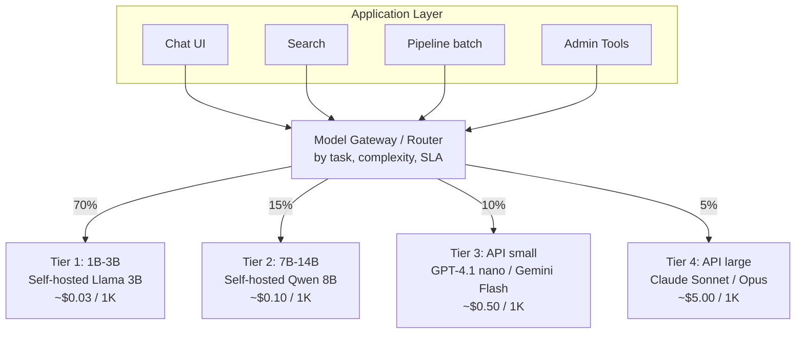

# The Hybrid Fleet: Mixing Model Sizes in One Application

## Fleet Composition Per Feature

| Feature              | Tier 1 (3B) | Tier 2 (8B) | Tier 3 (API small) | Tier 4 (Frontier) |
|----------------------|:-----------:|:-----------:|:------------------:|:-----------------:|
| Intent classification| 100%        | —           | —                  | —                 |
| FAQ / simple Q&A     | 80%         | 15%         | 5%                 | —                 |
| Document extraction  | —           | 90%         | 10%                | —                 |
| Complex chat         | —           | 20%         | 50%                | 30%               |
| Code generation      | —           | 40%         | 40%                | 20%               |
| Report writing       | —           | —           | 30%                | 70%               |
