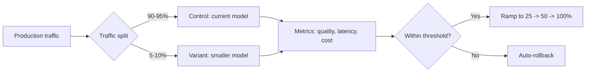

# A/B Testing Model Swaps

## Why A/B Test Model Changes?

- Offline evals do not capture the full picture of production behavior
- User satisfaction, engagement, and task completion rates matter
- Edge cases in production data may not appear in eval sets
- Stakeholder confidence requires empirical evidence

## A/B Test Design for Model Swaps

### Traffic Split
- Start with **5–10%** of traffic to the new (smaller) model
- Gradually ramp to 25%, 50%, then 100% if metrics hold
- Keep the original model as the control throughout

### Metrics to Track

| Metric Category    | Specific Metrics                           | Alert Threshold |
|--------------------|--------------------------------------------|:---------------:|
| Quality            | Task completion rate, accuracy, F1         | >2% drop        |
| User satisfaction  | Thumbs up/down, CSAT, retry rate           | >5% drop        |
| Latency            | TTFT, total response time, p99            | Improvement expected |
| Cost               | $/request, $/user, monthly spend           | Should decrease |
| Errors             | Hallucination rate, format failures, timeouts| >1% increase   |

### Statistical Rigor
- Minimum sample size: 1,000+ requests per variant
- Run for at least 1–2 weeks to capture weekly patterns
- Use sequential testing to enable early stopping
- Segment by query type — the small model may fail on specific categories

## Rollback Plan

- Automated rollback if quality drops below threshold
- Feature flag or traffic percentage toggle — instant switch
- Shadow mode: run both models, compare outputs, serve only one
- Log all inputs/outputs for post-hoc analysis
