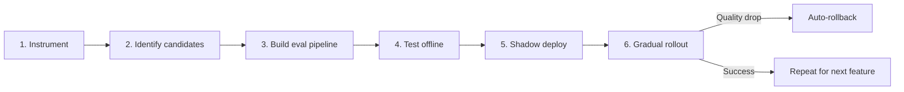

# Migration Strategy: Frontier to Small Models Safely

## Step 1: Instrument Your Current System
- Add logging for every LLM call: input, output, model, latency, cost
- Tag requests by feature, user segment, and complexity
- Establish baseline metrics for quality, cost, and latency
- Run for 2+ weeks to capture representative traffic patterns

## Step 2: Identify Migration Candidates
- Sort features by cost (highest spend first)
- Flag tasks with structured output (JSON, labels, SQL) — easiest wins
- Flag high-volume, low-complexity tasks — biggest cost savings
- Deprioritize tasks requiring complex reasoning or creativity

## Step 3: Build Your Eval Pipeline
- Extract 500+ real production examples per task
- Get ground-truth labels (human annotation or frontier model consensus)
- Automate: `run_eval(model, dataset) -> scores`
- Include latency and cost in the eval report

## Step 4: Test Candidate Models Offline
- Run 3–5 small model candidates through your eval pipeline
- Compare against frontier model baseline
- Identify the smallest model that meets your quality threshold
- Test with quantization to find the optimal size/quality trade-off

## Step 5: Shadow Deploy
- Run the small model in parallel with production (shadow mode)
- Compare outputs without serving to users
- Catch regressions before they impact anyone
- Duration: 1–2 weeks of production traffic

## Step 6: Gradual Rollout
- 5% traffic to small model with real-time quality monitoring
- Ramp to 25%, 50%, 100% over 2–4 weeks
- Automated rollback triggers on quality drops
- Celebrate the cost savings — then repeat for the next feature
