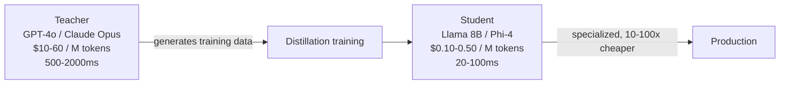

# Why Distill: Frontier Quality at Small-Model Cost

## Teacher (Frontier Model)

- **GPT-4o, Claude Opus, Gemini Ultra**
- Billions of parameters
- $10-60 per million tokens
- 500-2000ms latency per request
- Broad general knowledge
- Excellent at complex reasoning
- Too expensive for high-volume production

## Student (Distilled Model)

- **Llama 3 8B, Mistral 7B, Phi-3 Mini**
- Millions to low billions of parameters
- $0.10-0.50 per million tokens (self-hosted)
- 20-100ms latency per request
- Specialized for your task
- Matches teacher on narrow domain
- 10-100x cheaper at inference time

---

**The insight:** You don't need a PhD-level generalist to answer your customer support tickets. You need a specialist trained by one.
