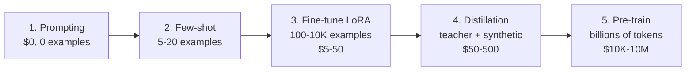

# The Customization Spectrum

## Step 1: Prompting
- Zero engineering effort
- No training data needed
- Limited by context window
- **Cost:** Free (per-token API cost only)
- **When:** Prototyping, simple tasks

## Step 2: Few-Shot / In-Context Learning
- 5-20 examples in the prompt
- No model modification
- Consumes context window tokens
- **Cost:** Slightly higher per-call token cost
- **When:** Consistent formatting, style matching

## Step 3: Fine-Tuning (LoRA/QLoRA)
- 100-10,000 training examples
- Modify model weights with adapters
- Task-specific behavior baked in
- **Cost:** $5-50 in compute, hours of work
- **When:** Domain adaptation, cost reduction

## Step 4: Knowledge Distillation
- Teacher generates synthetic training data
- Student fine-tuned on teacher outputs
- Captures reasoning patterns of larger model
- **Cost:** $50-500 in API + compute
- **When:** Production deployment at scale

## Step 5: Pre-Training from Scratch
- Billions of tokens of raw data
- Train entire model from random weights
- Full control over knowledge and behavior
- **Cost:** $10K-$10M+ in compute
- **When:** Almost never (for most teams)

---

**This week we focus on Steps 3 and 4** -- the sweet spot for applied AI teams.
