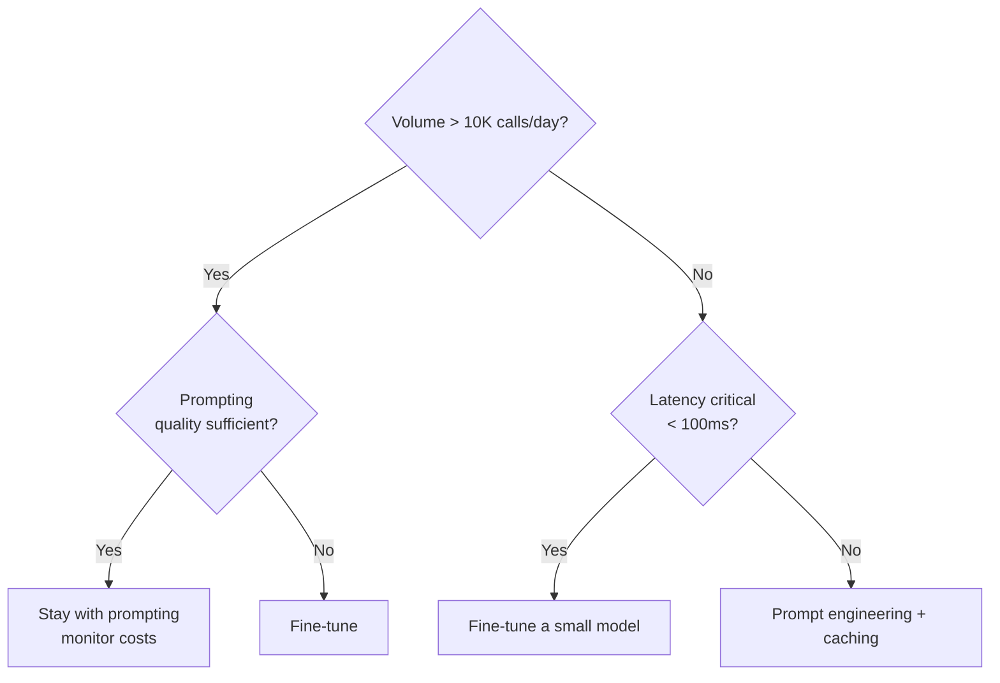

# When Fine-Tuning Beats Prompting

## Signs you need fine-tuning

- **Consistent output format:** JSON schemas, structured extraction, specific templates
- **Domain vocabulary:** Medical, legal, financial terminology the base model fumbles
- **Cost reduction:** Paying $0.10/call when a fine-tuned small model does it for $0.001/call
- **Latency requirements:** Need <100ms responses that large models cannot deliver
- **Privacy constraints:** Data cannot leave your infrastructure

## Signs you should stick with prompting

- Task changes frequently (fine-tuning is a snapshot in time)
- You have fewer than 50 high-quality examples
- The frontier model already does it well and volume is low
- You need broad general knowledge, not narrow specialization

## The decision framework

## Rule of thumb

**Fine-tuning ROI = (cost_per_api_call - cost_per_finetuned_call) x daily_volume x 30 - training_cost**

If positive within one month, fine-tuning is worth it.
