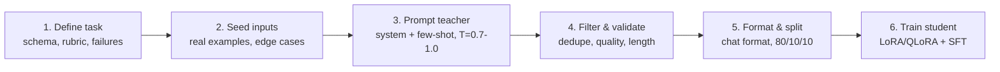

# Synthetic Data Pipeline



## Practical example: generating customer support data

```python
import openai

SYSTEM_PROMPT = """You are generating training data for a customer support bot.
Given a product and issue category, generate a realistic customer message
and an ideal agent response. Output as JSON:
{"customer": "...", "agent": "...", "category": "...", "sentiment": "..."}"""

SEED_TOPICS = ["billing", "shipping", "returns", "technical", "account"]
PRODUCTS = ["Pro Plan", "Enterprise", "Starter Kit", "API Access"]

for topic in SEED_TOPICS:
    for product in PRODUCTS:
        response = openai.chat.completions.create(
            model="gpt-4o",
            messages=[
                {"role": "system", "content": SYSTEM_PROMPT},
                {"role": "user", "content": f"Product: {product}, Issue: {topic}"}
            ],
            temperature=0.9,  # High diversity
            n=5               # 5 variations per combo
        )
```
