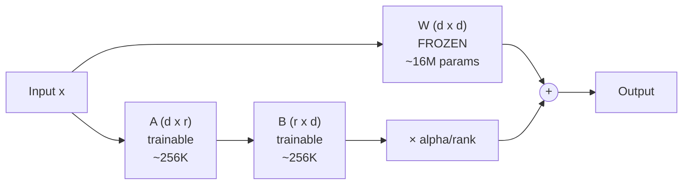

# How LoRA Works: Low-Rank Weight Decomposition



```
  Forward pass:   output = W @ x  +  (B @ A) @ x * (alpha / rank)

  Where:
    d = hidden dimension (e.g., 4096)
    r = rank (e.g., 16, 32, 64)  << much smaller than d
    alpha = scaling factor (typically 2 * rank)
```

## Why "low-rank"?

```
  Full weight update:     delta_W  is  4096 x 4096  = 16,777,216 parameters
  LoRA approximation:     B @ A    is  4096 x 16 x 16 x 4096 = 131,072 + 131,072
                                                                = 262,144 parameters

  That is a 64x reduction for rank=16!
```

## Initialization matters

```python
# A is initialized with random Gaussian values
nn.init.kaiming_uniform_(self.lora_A)

# B is initialized to ZERO
nn.init.zeros_(self.lora_B)

# This means: at the start of training, the adapter has NO effect
# output = W @ x + (0 @ A) @ x = W @ x
# Training gradually learns the delta from the pre-trained behavior
```

## The scaling factor: alpha / rank

- `alpha` controls how much the adapter influences the output
- Common setting: `alpha = 2 * rank` (so scaling = 2.0)
- Higher alpha = adapter has more influence = faster learning but less stable
- Lower alpha = more conservative updates = more stable but slower

## Sources

- [LoRA: Low-Rank Adaptation of Large Language Models (Hu et al., 2021)](https://arxiv.org/abs/2106.09685)
