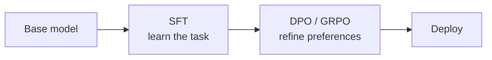

# DPO, GRPO and RLHF: Preference Alignment

## Beyond SFT: teaching what humans prefer

SFT teaches the model *what* to say. Preference alignment teaches it *which response is better* when multiple answers are possible.

## RLHF (Reinforcement Learning from Human Feedback)

1. Train a **reward model** on human preference data (A is better than B)
2. Use PPO (Proximal Policy Optimization) to optimize the LLM against the reward model
3. Complex, unstable, requires significant engineering

By 2026, **DPO has largely displaced RLHF in production** -- it is cheaper, more stable, and comparable in quality. Hugging Face **TRL v1.0** (April 2026) reflects this shift, treating DPO, GRPO, ORPO, and reward modeling as first-class, unified post-training pipelines rather than bolt-on scripts.

## DPO (Direct Preference Optimization) -- the simpler alternative

Skip the reward model entirely. Train directly on preference pairs.

```json
{
  "prompt": "Explain quantum computing simply.",
  "chosen": "Think of regular computers as coins that are heads or tails. Quantum computers are like spinning coins -- they can be both at once until you look.",
  "rejected": "Quantum computing utilizes quantum mechanical phenomena such as superposition and entanglement to perform computational operations on data, leveraging qubits instead of classical bits."
}
```

## DPO training with TRL

```python
from trl import DPOTrainer, DPOConfig

dpo_config = DPOConfig(
    output_dir="./dpo-output",
    num_train_epochs=1,           # DPO typically needs fewer epochs
    per_device_train_batch_size=2,
    gradient_accumulation_steps=8,
    learning_rate=5e-7,           # Much lower LR than SFT
    beta=0.1,                     # KL penalty -- controls how far from base model
    bf16=True,
    max_length=2048,
    max_prompt_length=1024,
)

trainer = DPOTrainer(
    model=model,
    ref_model=None,  # Uses implicit reference (PEFT adapter as ref)
    args=dpo_config,
    train_dataset=preference_dataset,
    processing_class=tokenizer,
)
trainer.train()
```

## GRPO (Group Relative Policy Optimization)

Introduced with **DeepSeek R1**, GRPO removes both the reward model *and* the value model entirely. Instead of scoring against a learned reward model, it ranks a *group* of sampled responses against each other and optimizes relative to the group mean. The payoff: lower memory footprint and faster training than PPO-style RLHF. GRPO is supported natively in **Unsloth** and **Hugging Face TRL v1.0** (April 2026).

## Typical pipeline



## When to add DPO

- Model produces correct answers but with poor style or tone
- You need to reduce harmful or undesirable outputs
- Multiple valid responses exist and you want to prefer one style
- You have (or can generate) preference pairs from your teacher model

## Sources

- [DPO: Direct Preference Optimization (Rafailov et al., 2023)](https://arxiv.org/abs/2305.18290)
- [Training Language Models to Follow Instructions with Human Feedback / InstructGPT (Ouyang et al., 2022)](https://arxiv.org/abs/2203.02155)
- [Reinforcement Learning (RL) Guide — GRPO (Unsloth Docs)](https://unsloth.ai/docs/get-started/reinforcement-learning-rl-guide)
- [Hugging Face Releases TRL v1.0: Unified Post-Training Stack for SFT, Reward Modeling, DPO, GRPO (MarkTechPost)](https://www.marktechpost.com/2026/04/01/hugging-face-releases-trl-v1-0-a-unified-post-training-stack-for-sft-reward-modeling-dpo-and-grpo-workflows/)
- [LLM Fine-Tuning Best Practices (HJ Labs)](https://hjlabs.in/AIML/blog/post/llm-fine-tuning-best-practices.html)
- [Hugging Face TRL](https://github.com/huggingface/trl)
