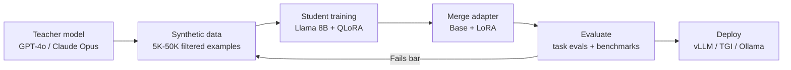

# End-to-End Distillation Pipeline



## Phase details with cost estimates

| Phase | Time | Cost | Key Decision |
|-------|------|------|-------------|
| Define task & seed data | 1-2 days | $0 | What exact behavior do you need? |
| Teacher generation | 4-12 hours | $50-500 (API) | How many examples? Quality vs quantity |
| Filtering & validation | 2-4 hours | $20-50 (judge LLM) | What quality threshold? |
| Student training | 1-4 hours | $5-20 (GPU) | What rank/epochs? |
| Evaluation | 2-4 hours | $0 (local compute) | Does it beat the baseline? |
| Merge & deploy | 30 min | $0 | Merge adapter or serve separately? |

## Total cost for a typical project

```
Teacher API calls (10K examples):     $100-300
Quality filtering (LLM judge):         $20-50
GPU compute (QLoRA training):           $5-20
Evaluation compute:                     $5-10
                                      ----------
Total:                                 $130-380

vs. running the teacher model in production:
10K calls/day x $0.01/call x 30 days = $3,000/month

ROI: Pays for itself in ~4 days
```
