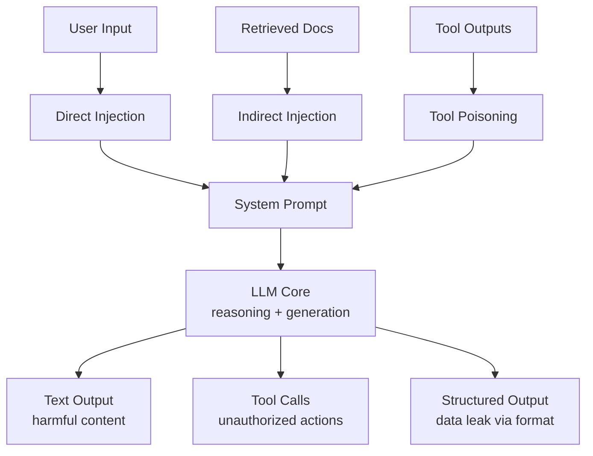

# Attack Surface of an AI Application

Every component is a potential entry point for adversarial behavior:

**Key insight:** Attacks enter through inputs but cause damage through outputs and actions.
