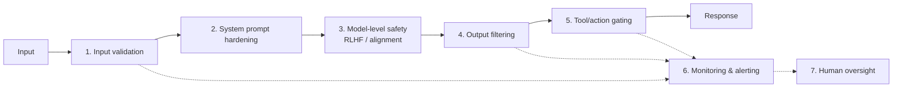

# Defense in Depth

## No Single Guardrail Is Enough

A single safety check is a single point of failure. Production AI systems need **multiple overlapping layers** of protection.

## The Layers

1. **Input validation** -- Sanitize, classify, and filter all user inputs before they reach the model
2. **System prompt hardening** -- Clear boundaries, instruction hierarchy, sandwich defense
3. **Model-level safety** -- RLHF alignment, safety training, refusal behaviors
4. **Output filtering** -- Classify and validate all model outputs before delivery
5. **Tool/action gating** -- Require confirmation for sensitive actions, enforce least privilege
6. **Monitoring & alerting** -- Detect anomalous patterns, log everything, respond to incidents
7. **Human oversight** -- Escalation paths, human-in-the-loop for high-stakes decisions

## Why Defense in Depth?

- Each layer catches what others miss
- Attackers must defeat **all** layers, not just one
- Graceful degradation -- if one layer fails, others still protect
- Mirrors proven security practices from traditional software engineering

> Think of it like airport security: ID check, bag scan, metal detector, air marshal -- no single layer is perfect, but together they work.
