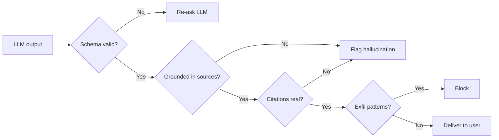

# Output Validation

## Schema Enforcement, Fact-Checking, and Citation Verification

Output validation ensures the model's responses are not only safe but also **correct, structured, and verifiable**.



## Schema Enforcement with Structured Outputs

```python
from pydantic import BaseModel, Field
from openai import OpenAI

class ProductRecommendation(BaseModel):
    product_name: str = Field(description="Name of the product")
    reason: str = Field(max_length=200)
    price_range: str = Field(pattern=r"^\$\d+-\$\d+$")
    confidence: float = Field(ge=0.0, le=1.0)

client = OpenAI()
response = client.beta.chat.completions.parse(
    model="gpt-4o",
    messages=[{"role": "user", "content": query}],
    response_format=ProductRecommendation,
)
# Guaranteed to match schema or raise an error
```

## Hallucination Detection via Source Grounding

```python
async def verify_grounded(response: str, sources: list[str]) -> dict:
    """Check if claims in the response are supported by sources."""
    verdict = await verifier_llm.evaluate(
        prompt=f"""Given these source documents:
        {sources}

        And this response:
        {response}

        For each factual claim, determine if it is:
        - SUPPORTED: directly supported by sources
        - NOT_SUPPORTED: contradicted or absent from sources

        List each claim and its verdict."""
    )
    return parse_verification(verdict)
```

## Citation Verification

```python
def verify_citations(response: str, documents: dict) -> list:
    """Ensure all citations reference real documents."""
    cited = extract_citations(response)  # e.g., [doc_1], [doc_3]
    issues = []
    for cite in cited:
        if cite not in documents:
            issues.append(f"Hallucinated citation: {cite}")
        elif not quote_exists_in_doc(cite, documents[cite]):
            issues.append(f"Misattributed quote: {cite}")
    return issues
```

## Defense Against Data Exfiltration in Outputs

```python
def check_exfiltration(output: str) -> bool:
    """Detect potential data exfiltration in model output."""
    # Check for markdown images (common exfil vector)
    if re.search(r"!\[.*?\]\(https?://", output):
        return True
    # Check for encoded data in URLs
    if re.search(r"https?://.*\?.*data=", output):
        return True
    # Check for base64-encoded content
    if re.search(r"[A-Za-z0-9+/]{50,}={0,2}", output):
        return True
    return False
```
