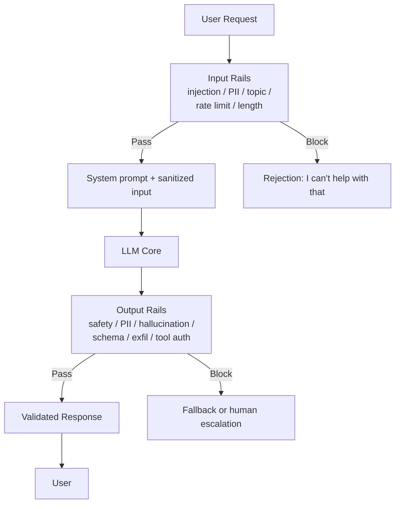

# Guardrail Architecture

## Input Rail --> LLM --> Output Rail

**Latency tip:** Run input rails in parallel where possible. Run output rails as streaming validators to minimize perceived latency.
