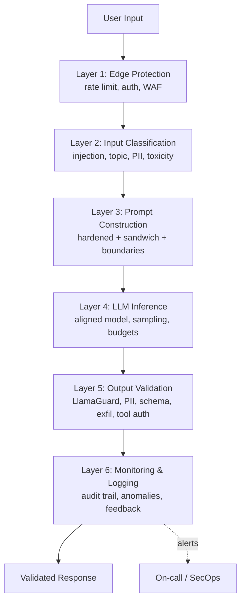

# Production Safety Architecture

## Complete Safety Pipeline from Input to Output

## Sources

- [Constitutional AI (Bai et al., 2022)](https://arxiv.org/abs/2212.08073)
- [RLHF / InstructGPT (Ouyang et al., 2022)](https://arxiv.org/abs/2203.02155)
- [Llama Guard (Inan et al., 2023)](https://arxiv.org/abs/2312.06674)
