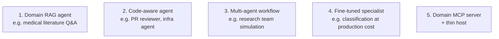

# Five Shapes Past Capstones Have Taken

| Pattern | What it is | When to pick it | Stack typically |
|---------|------------|-----------------|-----------------|
| **1. Domain RAG agent** | Retrieves from a corpus you scoped, generates with citations | You have a corpus and a clear question type | Vector + reranker; optional GraphRAG; one model |
| **2. Code-aware agent** | Reads a codebase, makes informed changes or recommendations | You're comfortable with the engineering | Agentic loop + MCP + workspace tools |
| **3. Multi-agent workflow** | Several specialized agents coordinate (researcher + writer + critic) | The problem decomposes naturally | LangGraph or similar; explicit message bus |
| **4. Fine-tuned specialist** | A small/open model fine-tuned to do one thing well, cheaply | You have labeled data and a clear metric | Llama 3.3 / Mistral + LoRA + eval harness |
| **5. Domain MCP server** | A reusable capability (your data, your action) exposed via MCP | The capability is what's interesting, the host is generic | MCP server + Claude Desktop / Cursor / custom host |

## Picking your pattern

Two questions, in order:

### 1. What's the most interesting thing about your problem?

If it's **the data** → Pattern 1 or 5.
If it's **the workflow** → Pattern 2 or 3.
If it's **the cost / scale** → Pattern 4.

### 2. What can you actually evaluate?

You need a metric. If you can't define one in advance, the pattern needs to change until you can.

- Pattern 1: accuracy + groundedness on a hand-built eval set
- Pattern 2: PR/issue resolution rate or correct-action rate
- Pattern 3: end-to-end task completion + agent-on-agent quality (review scores)
- Pattern 4: accuracy + per-token cost vs the teacher model
- Pattern 5: integration test coverage; per-tool latency

## What none of them are

**A chatbot.** "Chatbot for my company" is not a pattern — it's an interface. The capstone is about what the chatbot *does*, which falls into one of the five above.

Sources

- Reference past capstones: see `docs/capstone-examples/` (course repo)
