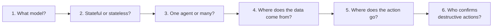

# Six Questions to Pin Down Early

## 1. What model?

Don't start with Opus 4.7 because it's the best. Start with the cheapest model that plausibly works for your task. Measure. Escalate only on measured failure. See lecture 12 for the small-model strategy.

## 2. Stateful or stateless?

- **Stateless:** every request stands alone (RAG-style Q&A). Easier to scale; no memory bugs
- **Stateful:** the agent remembers across turns (a coding agent that knows the file you're working on). Requires a memory model — see lecture 11

If you don't *need* statefulness, don't pay for it.

## 3. One agent or many?

A common over-design: starting with multi-agent for problems that fit in one model context. Heuristics:

- One agent if: the workflow is linear and the final answer is short
- Many agents if: there are explicit role boundaries (researcher / writer / critic / executor) **and** decomposition reduces context-window pressure

Multi-agent adds latency, cost, and debugging surface — only when justified.

## 4. Where does the data come from?

- **Pre-indexed corpus** → RAG (vector, graph, or hybrid). See lectures 4–6
- **Live API** → MCP servers wrapping the API. See lectures 8–9
- **User upload at runtime** → file handling, vision pipelines
- **Memory from past sessions** → memory store. See lecture 11

Most real capstones combine 2–3 of these. Be explicit about which.

## 5. Where does the action go?

If your agent only *reads*, the deployment story is easy. If it *writes* (sends a Slack message, creates a Jira ticket, modifies a database, opens a PR) the story gets harder fast. Plan auth, idempotency, and rollback before you write the tool, not after.

## 6. Who confirms destructive actions?

For any tool that has real-world side effects, decide:

- Always allow (read-only, no risk)
- Always ask (every destructive call goes to the user)
- Confirm above threshold (e.g., emails to fewer than 10 people auto-send; more, ask)

MCP's permission policy is the right place to enforce this. See lecture 8.

## Anti-pattern: deciding all of this at code-time

Write a one-page architecture sketch *before* writing code. Diagram it. Then build.

Sources

- [Anthropic — Tool use permission policies](https://docs.claude.com/en/docs/agents-and-tools/tool-use/overview)
- See lectures 3 (dev stack), 8 (MCP), 11 (memory) for component-level guidance
