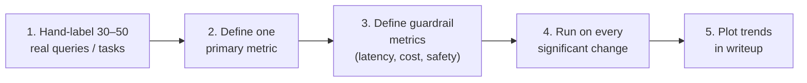

# You Need Numbers, Not Vibes

The single biggest predictor of a high-scoring capstone: **a measurable eval set built early, tracked through every commit**.



## A working eval looks like this

```python
@dataclass
class EvalCase:
    id: str
    input: dict          # query, file, whatever your agent takes
    gold_output: str     # human-written reference
    rubric: list[str]    # bullets the answer must address

async def run_eval(agent, cases, judge_model="claude-sonnet-4-6"):
    results = []
    for c in cases:
        out = await agent.run(c.input)
        score = await llm_judge(
            model=judge_model,
            input=c.input,
            gold=c.gold_output,
            rubric=c.rubric,
            actual=out,
        )
        results.append({"id": c.id, "score": score.value,
                         "reasoning": score.reasoning, "out": out})
    return results
```

## What to measure

| Dimension | Common metric |
|-----------|---------------|
| Quality | LLM-judge score on rubric (0–5) |
| Latency | p50 / p95 end-to-end seconds |
| Cost | $ per task (tokens × pricing) |
| Safety | Refusal rate on adversarial set |
| Coverage | % of cases producing *some* answer |

## What not to measure

- **Lines of code.** Negative correlation with quality at this stage
- **Benchmark numbers transferred from papers.** Only relevant for the benchmark's task
- **Tokens used per turn.** Easy to optimize; rarely matters; can come at the expense of quality

## Pre-commit eval gates

Some capstones add an eval gate to their git pre-commit hook: refuse to merge if the eval drops more than 2 points. This is the highest-leverage discipline in any of the past well-scored capstones — even when the gate is informal.

## A practical pitfall

Building the eval set is *more boring* than building the agent. So people skip it. **It will determine your grade.** Allocate at least 25% of your time to eval design and execution.

Sources

- [Anthropic — evaluating LLM applications](https://docs.claude.com/en/docs/test-and-evaluate/develop-tests)
- [Ragas — open-source eval framework](https://github.com/explodinggradients/ragas)
- Week 7 (Evaluation & LLM-as-a-Judge) — the long version of this lecture
