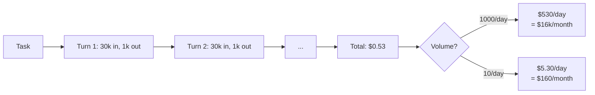
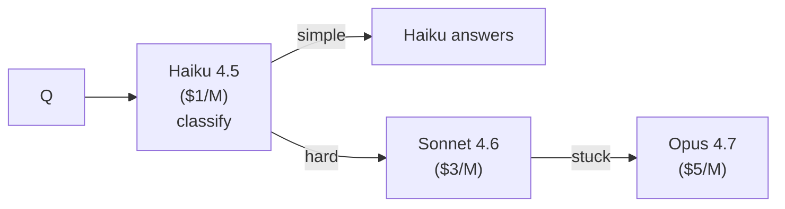

# Estimate Before You Build

Capstones rarely fail because the model is too weak. They sometimes fail because the architecture chosen costs $5 per request and the demo budget allows for $0.05.

## The cost-of-a-task calculation

For any agentic system, total cost per task ≈

`Σ (input_tokens × $in + output_tokens × $out) × n_calls`

For a typical Pattern-2 coding agent:

- 30k input tokens per turn (system + tools + context + history)
- 1k output tokens per turn
- 5 turns to finish a task
- Sonnet 4.6 ($3 in / $15 out)

⇒ `5 × (30000 × 3e-6 + 1000 × 15e-6) = 5 × (0.09 + 0.015) = $0.53 / task`

## Where the cost concentrates

- **Long agentic loops** — N turns of high context blows the budget. Compaction (lecture 11) or smaller models for sub-tasks help
- **High output volumes** — `$15/M output` × 10k tokens = $0.15 per call. Use structured outputs to bound
- **Re-embedding on retrieval** — embedding the query is cheap; re-embedding the entire corpus per change is expensive
- **GraphRAG indexing** — one-time but real. See lecture 6

## Two cost-reducing patterns

### 1. Tiered models

90% of traffic served by the cheapest tier; only the hard 10% escalates.

### 2. Aggressive prompt caching

Anthropic's API caches identical system prompts at ~10% of normal cost on cache reads. A 5k-token system prompt re-used across 1000 requests saves ~$13.50. See [prompt caching docs](https://docs.claude.com/en/docs/build-with-claude/prompt-caching).

## What to include in your writeup

A small table:

| Component | Per-task cost | Notes |
|-----------|---------------|-------|
| Retrieval embedding | $0.001 | text-embedding-3-large |
| Agent loop (avg 5 turns Sonnet 4.6) | $0.53 | |
| Final summarization (Haiku 4.5) | $0.005 | |
| **Total** | **~$0.54** | At 1000 tasks/day: $16k/month |

Sources

- [Anthropic — pricing](https://www.anthropic.com/pricing)
- [Anthropic — prompt caching](https://docs.claude.com/en/docs/build-with-claude/prompt-caching)
