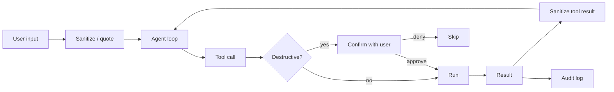

# Before You Demo

A short, opinionated checklist. Hitting all of these doesn't make your system safe; failing any of them makes it definitely unsafe.

## Inputs

- [ ] User input is **never** concatenated into the system prompt
- [ ] Tool results are treated as **untrusted text** for prompt-injection purposes
- [ ] Long-running tool outputs are bounded (max bytes returned)
- [ ] Personally identifiable information is redacted from logs by default

## Actions

- [ ] Every destructive tool has a confirmation step (lecture 8, permission policies)
- [ ] Outbound writes (email, Slack, PR creation) are dry-run capable
- [ ] No tool runs SQL without a read-only enforcement layer
- [ ] Idempotency keys on any external writes that could be retried

## Models

- [ ] You explicitly check `stop_reason == "refusal"` and handle it (lecture 14)
- [ ] Adversarial inputs from your eval set don't produce destructive outputs
- [ ] If you use multiple models, you don't pass model output from one model into another's tool call without sanitization

## Operations

- [ ] You have an emergency stop (kill switch / circuit breaker) for the agent loop
- [ ] You can roll back deployed prompt changes without redeploying code
- [ ] You log every tool call with timestamp, args summary, result summary
- [ ] You can identify which model version produced which output, ex post

## Two things to skip if you don't have time

- **Building your own jailbreak eval.** It's a research project. Use [Anthropic's safety eval prompts](https://docs.claude.com/en/docs/test-and-evaluate/strengthen-guardrails) or [HarmBench](https://github.com/centerforaisafety/HarmBench) as a baseline
- **Custom content moderation.** Llama-Guard or a hosted classifier (Anthropic, OpenAI moderation API) is good enough for capstone scope

## What to *not* skip

- Permission policies on tools with side effects
- Logging
- A clearly-documented emergency stop

Sources

- [Anthropic — safety best practices](https://docs.claude.com/en/docs/test-and-evaluate/strengthen-guardrails)
- [Llama-Guard 3](https://huggingface.co/meta-llama/Llama-Guard-3-8B)
- [HarmBench](https://github.com/centerforaisafety/HarmBench)
- Week 14 (Safety & Red-Teaming) — the long version
