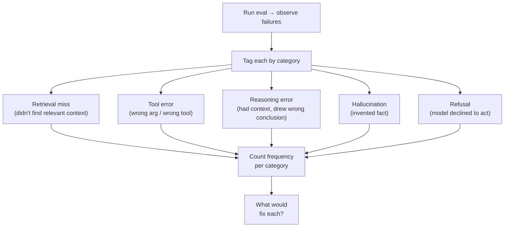

# The Section That Distinguishes Good From Great

The capstone writeup has a section called "Failure Analysis." It is graded heavily. Past capstones that scored A vs B+ usually diverged on this section, not on the system itself.

## What it isn't

- A list of features you didn't ship
- An apology for not solving everything
- A discussion of LLM limitations in general

## What it is

- A **categorization** of the failure modes you observed
- **Concrete examples** of each, with input → output → why
- An honest assessment of which are fixable with engineering and which require fundamentally different choices
- An assessment of how *frequent* each failure mode is, in your real eval

## A worked example

> *"23 of 50 evaluation cases produced unsatisfactory outputs. Categorized:*
> - *12 retrieval misses (the right document existed in the corpus but ranked outside top-10). Fixable with a better reranker — tried `voyage-rerank-2` on a subset and recovered 8 of 12.*
> - *6 reasoning errors (correct context retrieved; model concluded wrong). 4 of these were one-step multi-hop; might benefit from explicit chain-of-thought scaffolding.*
> - *3 tool errors (model called `update_record` with stale ID after a long context). Could fix with stricter tool schema or explicit state-refresh tool.*
> - *2 refusals on edge-case inputs that the safety guardrail flagged as risky but were benign in context."*

That paragraph is worth ~5% of the capstone grade.

## How to gather the data

1. Run your eval set
2. For every case scored < 3 / 5, classify by hand into one of your categories
3. Pick 1–2 representative examples per category for the writeup
4. **Don't paraphrase** — quote the actual inputs and outputs

## Two things to avoid

- **"It works most of the time."** That's not analysis. Measure "most".
- **Pretending all failures are model failures.** Most aren't — most are pipeline failures (chunking, retrieval ranking, prompt design). Be specific

Sources

- See `docs/capstone-rubric.md` (failure-analysis dimension)
