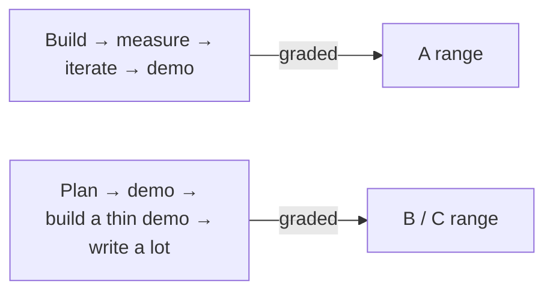

# What's Cost Past Students Points

## Scope mistakes

- **Choosing too broad a problem.** "Build an AI doctor" can't be evaluated. "Diagnose three categories of patient intake forms from sample data" can
- **Choosing a problem with no available data.** If you can't get a corpus or labeled examples by week 12, you can't evaluate. Switch
- **Choosing a problem already solved by a single API call.** "Summarize a PDF" — Claude does this in one call. Your system has to add value beyond that

## Engineering mistakes

- **Building before architecting.** A 30-minute architecture sketch saves weeks
- **Optimizing the wrong dimension.** People micro-tune prompts for marginal quality gains while their retrieval misses 40% of the cases
- **Reinventing what an MCP server already does.** Half of past capstones rewrote a GitHub or Slack integration from scratch. Use the published servers

## Eval mistakes

- **Skipping the eval set.** This is the single most common cause of B+ vs A grades
- **Evaluating on the same data the system was tuned on.** Hold-out split is non-negotiable
- **LLM-judge contamination.** If your judge model is the same as your generator, scores inflate. Use a different family

## Demo mistakes

- **No live demo.** "Here are some screenshots of when it worked" — not enough
- **Long architecture lecture, short demo.** Audience wants to see the thing *do something*
- **No failure case shown.** Demos without failure cases feel fake and are graded as such

## Writeup mistakes

- **No numbers.** Every claim ("worked well", "fast", "cheap") needs a number
- **No failure analysis.** See previous slide
- **Architecture diagram with everything labeled "LLM."** Specify which model, which framework, which version
- **Demo screenshots without the failure column.** Always show both

## One meta-mistake

Treating the capstone as **a presentation about an AI system** rather than **an AI system that you happen to present**. The system is the deliverable. The presentation is the proof that the system exists and works.

Sources

- `docs/capstone-rubric.md`, especially the "deliverable weight" table
