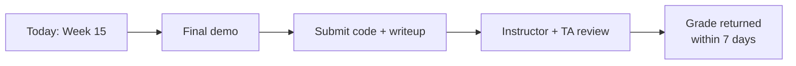

# Dates, Submissions, Office Hours

| Date | Milestone |
|------|-----------|
| Week 10 | One-page project proposal due (problem, pattern, model, eval plan) |
| Week 12 | First eval results due (≥ 10 cases, baseline numbers) |
| Week 14 | Code freeze for the demo |
| Week 15 (this week) | Final demo + writeup due |
| Week 15 + 1 week | Optional revised writeup (caps at A-) |

## What to submit

- **Code:** a git repo. `README.md` must include setup steps that a TA can follow without you. CI optional but encouraged
- **Writeup:** 4–6 pages, PDF, with diagrams. Either Markdown→PDF or LaTeX, either is fine
- **Demo recording:** 15 minutes max, mp4 or unlisted YouTube. Required even if you also did it live
- **Eval results:** CSV or JSON file with one row per eval case, including the model output and judge score

## Office hours

Two extended office-hours blocks scheduled for week 14:
- Architecture sanity check (book a 15-min slot)
- Eval review (book a 15-min slot)

Both are optional but most A-range capstones in past years took both.

## What you can ask the instructor for

- Help debugging the *eval harness*
- Help thinking through *architecture trade-offs*
- A pointer to *existing tools or papers* relevant to your problem
- Feedback on the *one-page proposal* before you build

## What you can't ask the instructor for

- A pre-grade of your demo
- A guarantee of which features will earn what score
- Help debugging your *code* (use your TAs, peers, and the model itself)

## Use the course infrastructure

This course's repo has working examples of:

- An MCP server (see `examples/mcp-server-quickstart/`)
- A RAG pipeline with eval (see `examples/rag-eval/`)
- An agentic loop with tool use (see `examples/agent-loop/`)

Use them. They are pre-vetted, eval-friendly, and TA-debuggable.

Sources

- See `docs/capstone-logistics.md` for the canonical schedule
